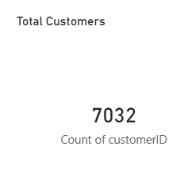
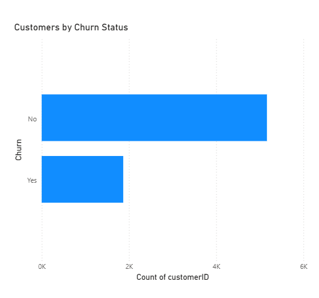
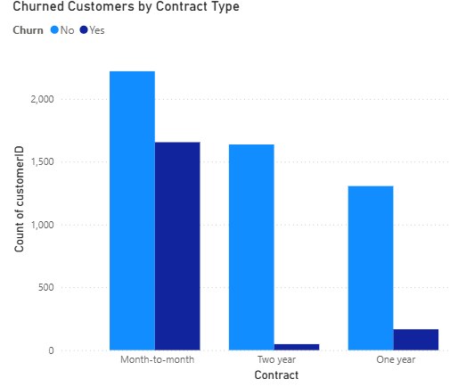

# Customer Churn Analysis (SQL & Power BI)

## Overview
This project analyzes customer churn using a telecom dataset to identify retention patterns and churn drivers.

## Tools Used
- SQL (MySQL)
- Power BI

## Key Insights
- Month-to-month contracts have the highest churn.
- Long-term contracts show better customer retention.
- Churned customers differ in billing behavior.

## Dashboard Screenshots

### Total Customers

### Customers by Churn Status

### Churn by Contract Type

## Files
- `data/` – Dataset
- `sql/` – SQL queries
- `powerbi/` – Power BI dashboard file
- `screenshots/` – Dashboard images
